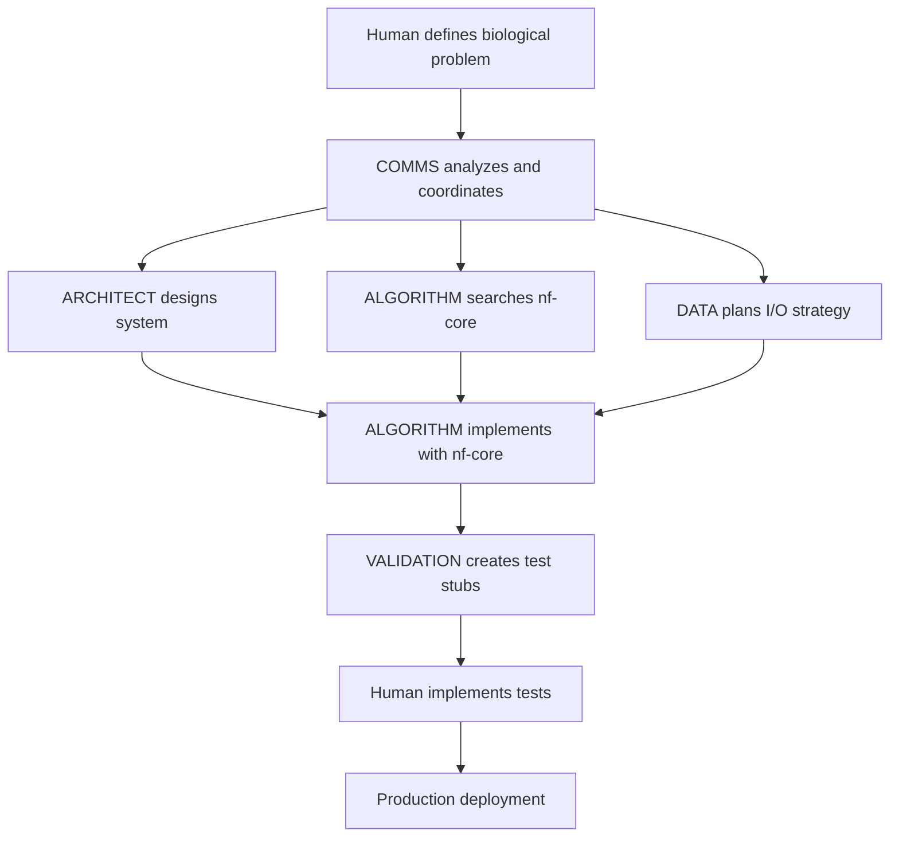

# Bioinformatics Agents for Claude Code

A collection of specialized bioinformatics sub-agents designed for coordinated multi-agent workflows with Claude Code. These agents provide intelligent, domain-aware assistance for bioinformatics development projects.

## 🧬 Agent Architecture

### Core Agents
- **COMMS** - Communication coordinator that orchestrates multi-agent workflows
- **ARCHITECT** - System design agent for reproducible bioinformatics architectures  
- **ALGORITHM** - Implementation agent with nf-core integration priority
- **VALIDATION** - Test design agent (creates stubs, never implements)
- **DATA** - Data management agent for biological formats and I/O operations

### Key Features
- **Prompt Engineering Optimized** - Uses XML structure, role-based prompting, and multishot examples
- **nf-core Integration** - Algorithm agent prioritizes community solutions before custom implementation
- **Human-in-the-Loop Testing** - Validation agent creates comprehensive test stubs for human implementation
- **Context Isolation** - Clean agent coordination using Claude Code's Task tool
- **Domain Adaptation** - Agents adapt behavior for genomics, proteomics, metabolomics, and multi-omics

## 🚀 Quick Start

### 3-Step Installation

```bash
# Step 1: Initialize Claude Code in your project
claude init

# Step 2: Clone this repo into your project  
git clone https://github.com/yourusername/bioinfo_agents bioinfo_agents_temp

# Step 3: Run the deployment script
./bioinfo_agents_temp/deploy.sh
```

That's it! The script will:
- Detect if you have an existing codebase or new project
- Copy agents to `.claude/agents/`
- Update your `CLAUDE.md` with agent documentation
- Create `.agent_workspace/` structure
- Clean up the temporary repo

### Usage

```bash
# Start a new genomics project
claude --agent comms "Design RNA-seq differential expression pipeline"

# Optimize existing algorithms  
claude --agent algorithm "Review existing variant calling code for nf-core alternatives"

# Add comprehensive testing
claude --agent validation "Create test strategy for proteomics identification pipeline"
```

## 📁 Project Structure

```
bioinfo_agents/
├── agents/                 # Agent definitions
│   ├── COMMS.md           # Communication coordinator
│   ├── ARCHITECT.md       # System design agent
│   ├── ALGORITHM.md       # Implementation agent
│   ├── VALIDATION.md      # Test design agent
│   └── DATA.md            # Data management agent
├── deploy.sh              # Simple deployment script
└── CLAUDE.md              # Agent development guidance
```

## 🛠️ What the Deployment Does

The `deploy.sh` script automatically:

### Codebase Detection
- **Existing Codebase** (>50 code files): Adapts agents for integration and enhancement
- **New Project**: Configures agents for greenfield development with best practices

### Smart Setup
- Copies all 5 agents to `.claude/agents/`
- Creates organized `.agent_workspace/` directory structure  
- Appends comprehensive agent documentation to `CLAUDE.md`
- Includes codebase-specific usage guidance
- Self-cleans by removing the temporary repo

## 🧠 Intelligent Codebase Adaptation

The deployment script automatically detects:

### Existing Codebase (>50 code files)
- **Integration Focus** - Agents analyze current architecture before suggesting changes
- **Incremental Improvements** - Gradual enhancement rather than complete rewrites  
- **Compatibility Priority** - Respect existing patterns while modernizing
- **Risk Assessment** - Evaluate impact of proposed changes

### New Project (Greenfield)
- **Best Practice Foundation** - Establish optimal patterns from start
- **Comprehensive Design** - Full multi-agent workflow coordination
- **Modern Standards** - Latest bioinformatics tools and patterns
- **Future-Proofing** - Design for scalability and maintainability

## 📊 Agent Coordination Workflow



## 🔬 Domain-Specific Features

### Genomics
- Variant calling pipelines with GATK/nf-core integration
- RNA-seq analysis workflows with DESeq2/edgeR patterns
- Genome assembly and annotation strategies

### Proteomics  
- Mass spectrometry data processing workflows
- Protein identification and quantification pipelines
- FDR control and statistical validation patterns

### Metabolomics
- Peak detection and metabolite identification
- Pathway analysis and enrichment testing
- Multi-sample comparison and statistical analysis

### Multi-omics
- Cross-platform data integration strategies  
- Correlation analysis and pathway mapping
- Comprehensive validation across data types

## 📋 Agent Outputs

All agent work is organized in `.agent_workspace/`:

```
.agent_workspace/
├── coordination/          # COMMS outputs
│   ├── project_plan.md
│   ├── agent_handoffs/
│   └── status_reports/
├── architecture/          # ARCHITECT outputs  
│   ├── design.md
│   └── interfaces.yaml
├── implementation/        # ALGORITHM outputs
│   ├── algorithms/
│   └── modules/
└── data/                 # DATA outputs
    ├── raw/
    ├── processed/
    ├── parsers/
    └── integrations/
```

## 🧪 Testing Philosophy

The **VALIDATION** agent creates comprehensive test stubs but **never implements test logic**:

```python
def test_variant_calling_accuracy():
    """
    Test: Variant calling sensitivity against GIAB truth set
    Context: Ensures clinical-grade accuracy for diagnostics
    
    TODO (HUMAN IMPLEMENTATION REQUIRED):
    1. Load GIAB benchmark data
    2. Run variant caller on test samples  
    3. Calculate sensitivity/specificity metrics
    4. Verify >99% accuracy thresholds
    
    Resources: GIAB truth sets, test FASTQ files
    Success: >99% sensitivity, >99.5% specificity
    """
    raise NotImplementedError("Human implementation required")
```

## 🔧 Configuration

### Repository URL Setup
Edit `deploy-agents.sh` to set your repository URL:
```bash
AGENTS_REPO_URL="https://github.com/yourusername/bioinfo_agents"
```

### Domain Customization
Agents adapt their behavior based on selected domain:
- **genomics** - Focus on DNA/RNA analysis patterns
- **proteomics** - Emphasize mass spectrometry workflows  
- **metabolomics** - Metabolite identification and pathway analysis
- **multi-omics** - Cross-platform integration strategies

## 📚 Documentation

- [`CLAUDE.md`](CLAUDE.md) - Development guidance for improving agents
- Individual agent files in `agents/` - Detailed agent specifications and examples
- Project `CLAUDE.md` (after deployment) - Complete agent interaction guide

## 🤝 Contributing

1. Test agent improvements in real bioinformatics projects
2. Maintain YAML frontmatter structure in agent definitions
3. Follow prompt engineering best practices (XML structure, examples, etc.)
4. Preserve human-in-the-loop testing philosophy
5. Document any breaking changes to agent interfaces

## 📄 License

[Add your license information here]

## 🆘 Troubleshooting

### Agent Not Found
Ensure agents are in `.claude/agents/` and have proper YAML frontmatter.

### Coordination Issues  
Check that COMMS agent has access to Task and TodoWrite tools.

### nf-core Integration Problems
Verify WebSearch tool is available for ALGORITHM agent.

### Test Stub Issues
Confirm VALIDATION agent never implements - only creates stubs with `NotImplementedError`.

---

**Ready to enhance your bioinformatics development?** 

```bash
claude init
git clone <this-repo> bioinfo_agents_temp  
./bioinfo_agents_temp/deploy.sh
```

Then start with: `claude --agent comms "Design my genomics pipeline"` 🧬✨